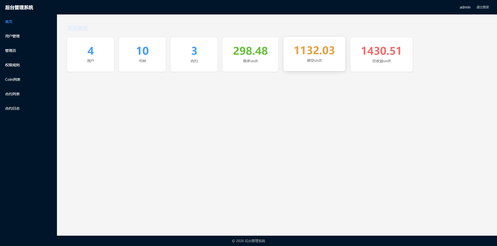
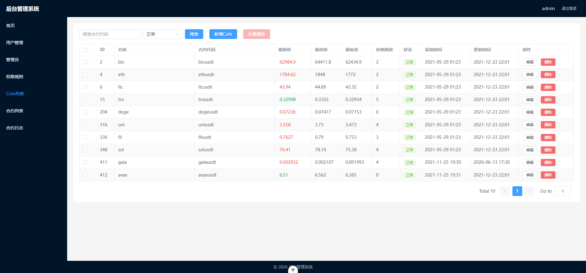
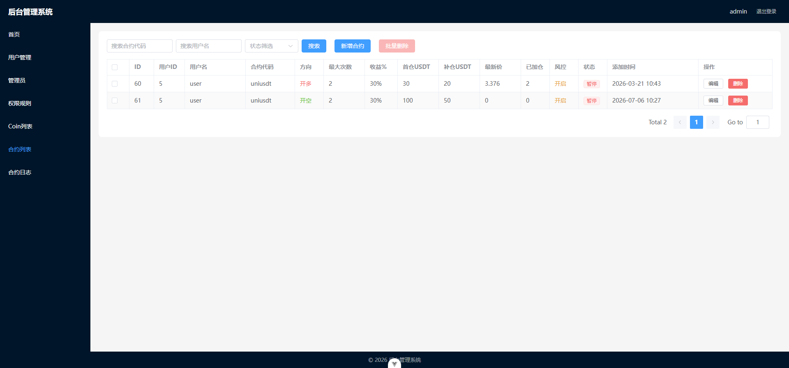
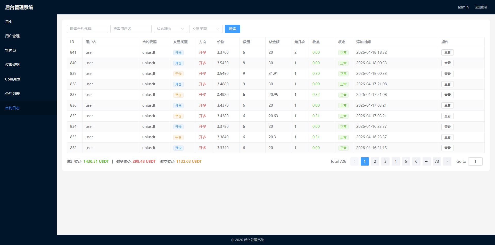
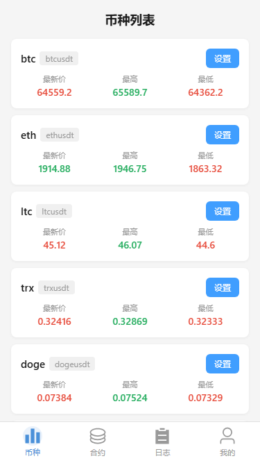
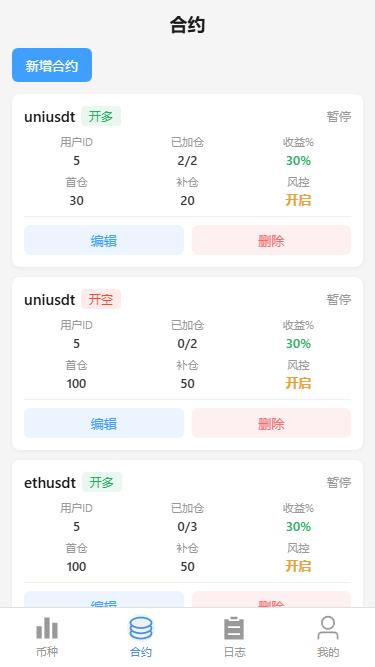
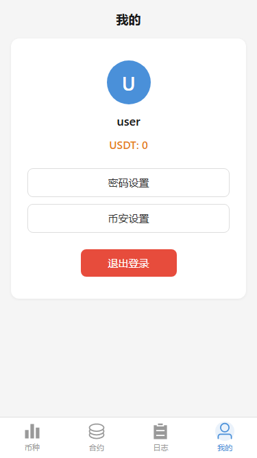
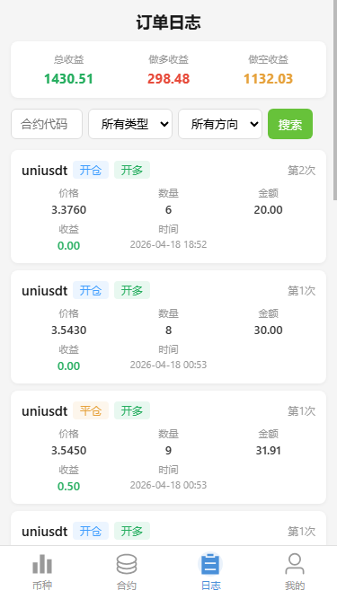

# webadmin
### 配置文件  
* 导入数据库文件  ./bak/webadmin.sql
* ./Backend/bak.env 更改成.nev
* 更改.nev的MySQL账号和密码

codex 使用gin和vue生成管理 程序

### 后台界面截图

首页看板：

币种管理：

合约管理：

合约订单：

### 手机版截图

手机版币种：

手机版合约：

手机版我的：

手机版日志：

